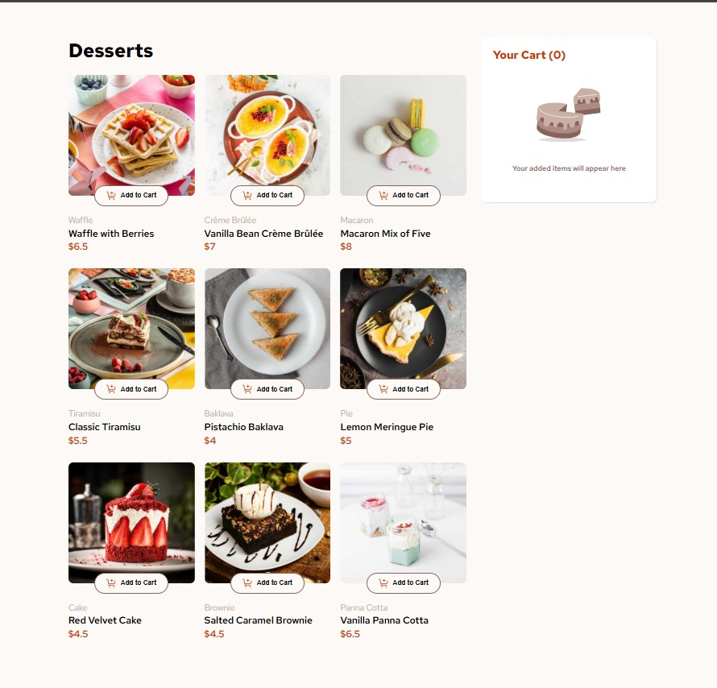

# Frontend Mentor - Product list with cart solution

This is a solution to the [Product list with cart challenge on Frontend Mentor](https://www.frontendmentor.io/challenges/product-list-with-cart-5MmqLVAp_d). Frontend Mentor challenges help you improve your coding skills by building realistic projects. 

## Table of contents

- [Overview](#overview)
  - [The challenge](#the-challenge)
  - [Screenshot](#screenshot)
  - [Links](#links)
- [My process](#my-process)
  - [Built with](#built-with)
  - [What I learned](#what-i-learned)
  - [Continued development](#continued-development)
  - [Useful resources](#useful-resources)
- [Author](#author)
- [Acknowledgments](#acknowledgments)

## Overview

### The challenge

Users should be able to:

- Add items to the cart and remove them
- Increase/decrease the number of items in the cart
- See an order confirmation modal when they click "Confirm Order"
- Reset their selections when they click "Start New Order"
- View the optimal layout for the interface depending on their device's screen size
- See hover and focus states for all interactive elements on the page

### Screenshot



### Links

- Solution URL: [ AIY7788-Solution](https://github.com/AIY7788/product-list-with-cart)
- Live Site URL: [AIY7788-live-site](https://aiy7788.github.io/product-list-with-cart/)

## My process

### Built with

- Semantic HTML5
- CSS Flexbox & Grid
- CSS Variables for theming
- Vanilla JavaScript (ES6 Modules)
- Fetch API to load product data from data.json
- Event Delegation for dynamic UI interaction
- Responsive Design (Mobile-first approach)

### What I learned

While building this project, I learned how to:

- Load external data asynchronously using the Fetch API
- Store product data globally and render it dynamically
- Use event delegation to handle multiple buttons efficiently
- Manage cart state (add, remove, and update quantities) in a separate module
- Re-render UI sections (like order summary and confirmation modal) dynamically

Example snippet I’m proud of:

```js

document.addEventListener('click', e => {
  if (e.target.closest('.add-to-cart-btn')) {
    const button = e.target.closest('.add-to-cart-btn');
    const { productName, productPrice } = button.dataset;

    addToCart(1, productName, productPrice);
    renderOrderSummary();
  }
});

```
This event delegation method makes the code cleaner and prevents adding too many listeners to each button individually.

### Continued development

In future updates, I’d like to:

- Add localStorage support to persist cart data
- Include animations for cart updates and modal transitions
- Improve accessibility (keyboard navigation and ARIA roles)
- Convert this project to React for more scalable state management

### Useful resources

- [MDN Web Docs - Fetch API](https://developer.mozilla.org/en-US/docs/Web/API/Fetch_API) 
- [MDN Web Docs - Dataset API](https://developer.mozilla.org/en-US/docs/Web/API/HTMLElement/dataset)

## Author

- GitHub - [AIY7788](https://github.com/AIY7788)
- Frontend Mentor - [@AIY7788](https://www.frontendmentor.io/profile/AIY7788)

## Acknowledgments

This project was completed independently as a personal learning challenge.  
Special thanks to [Frontend Mentor](https://www.frontendmentor.io/) for providing the design and concept.